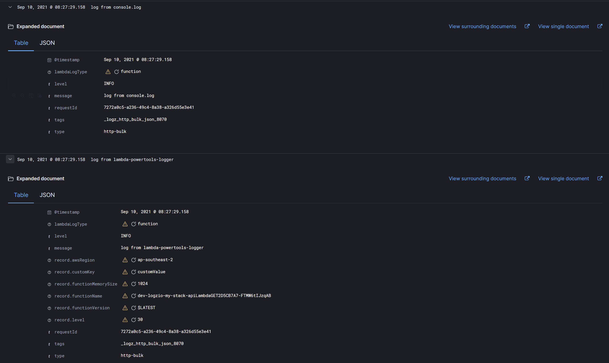
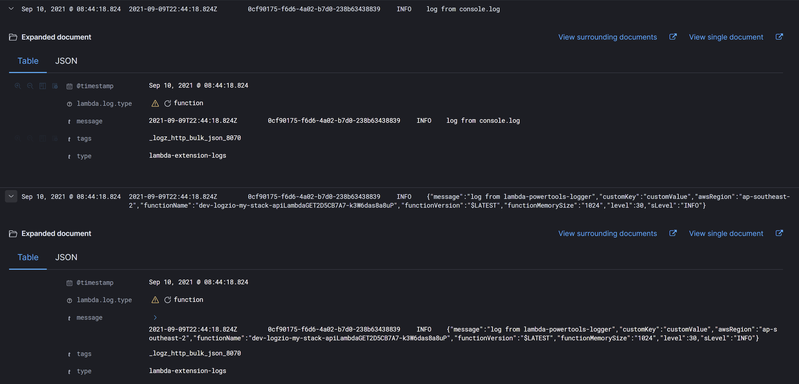

# logzio-lambda-logs-api-extension


An AWS Lambda Extension that uses the [Logs API](https://docs.aws.amazon.com/lambda/latest/dg/runtimes-logs-api.html) to send logs to [Logz.io](https://logz.io/)

## Usage

To use the `logzio-lambda-logs-api-extension` with a lambda function, it must be configured as a [layer](https://docs.aws.amazon.com/lambda/latest/dg/invocation-layers.html).

Once the layer has been added, logging using `console` or a structured logging library (i.e. [lambda-powertools-logger](https://github.com/getndazn/dazn-lambda-powertools/tree/master/packages/lambda-powertools-logger)) as seen below

```javascript
import log from '@dazn/lambda-powertools-logger'

export const handler: APIGatewayProxyHandlerV2 = async (
  event: APIGatewayProxyEventV2,
) => {
  console.info('log from console.log')

  log.info('log from lambda-powertools-logger', {
    customKey: 'customValue',
  })

  return {
    statusCode: 200,
    headers: {'Content-Type': 'text/plain'},
    body: `Hello, World! Your request was received at ${event.requestContext.time}.`,
  }
}
```

Will result in log messages in Logz.io like the following:



## Why not use the official one

Logzio have [their own extension](https://github.com/logzio/logzio-lambda-extensions/tree/main/logzio-lambda-extensions-logs) however it is not structured log aware resulting in logs like the following:



## Environment Variables

The extension will read the following environment variables from your lambda function configuration:

| Name | Description |Required/Default|
| --- | --- | --- |
| `LOGZIO_LOGS_TOKEN` | Your Logz.io log shipping [token](https://app.logz.io/#/dashboard/settings/manage-tokens/data-shipping). | Required |
| `LOGZIO_LISTENER` |  Your  Logz.io [listener address](https://docs.logz.io/user-guide/log-shipping/listener-ip-addresses.html), with port 8070 (http) or 8071 (https). For example, for example: `http://listener-au.logz.io:8070` | Required |
| `LOGS_API_ENABLE_PLATFORM_MSGS` | Set to `true` in order to enable `platform` messages from the logs API. | Default: `false` |
| `LOGS_API_TIMEOUT_MS` | The maximum time (in milliseconds) to buffer a batch. minimum `25`. maximum `30,000`. | Default: `1,000` |
| `LOGS_API_MAX_BYTES` | The maximum size (in bytes) of the logs to buffer in memory. minimum `262,144`. maximum `1,048,576`. | Default: `262,144` |
| `LOGS_API_MAX_ITEMS` | The maximum number of events to buffer in memory. minimum `1,000`. maximum `10,000`. | Default: `1,000` |
| `DEBUG` | This extension uses the [debug](https://www.npmjs.com/package/debug) package for debug logging. Set this variable to `*` to enable |  |

## Building & Deploying

To build the lambda extension, execute the following commands

```
> yarn install
> yarn build
```

This will run the tests, create the extension zip archive file in the `dist` folder and then output the aws cli command to deploy the extension (by default it will use region `ap-southeast-2` but change to your particular region)


```
aws lambda publish-layer-version --layer-name "logzio-lambda-logs-api-extension" --region ap-southeast-2 --zip-file  "fileb://./dist/extension.zip"
```

## License

Distributed under the MIT License. See `LICENSE` for more information.
